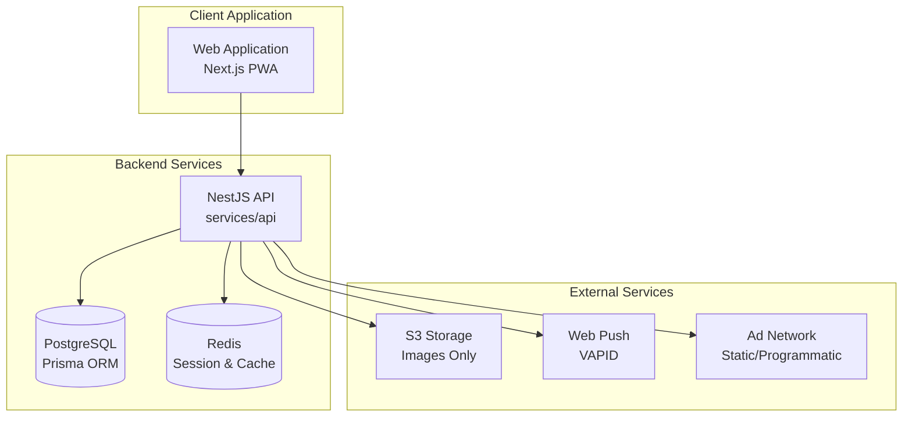

# Design Document

## Overview

Otsukai DX Pivot is a privacy-first collaborative shopping management platform built as a monorepo with a single web application and backend API. The system enables household and friend groups to collectively manage shopping lists, coordinate purchases, and fairly split costs. The architecture eliminates all payment processing, KYC verification, and location tracking components, focusing instead on group collaboration and ad-supported revenue generation.

The platform follows a simplified architecture with equal user roles (no service providers), minimal data collection (email and display name only), and non-intrusive advertising integration.

## Architecture

### High-Level Architecture



### Technology Stack

- **Monorepo Management**: Yarn + Turborepo
- **Backend**: NestJS with TypeScript
- **Database**: PostgreSQL with Prisma ORM
- **Frontend**: Next.js 14+ with TypeScript (PWA enabled)
- **Styling**: Tailwind CSS with golden/silver ratio design system
- **Authentication**: JWT with refresh tokens (email + password only)
- **File Storage**: S3-compatible storage for receipt images only
- **Push Notifications**: Web Push API with VAPID
- **Real-time**: Server-Sent Events (SSE) for group updates
- **Type Safety**: OpenAPI-generated TypeScript types

### Monorepo Structure (Simplified)

```
/
├── apps/
│   └── web/               # Single web application for all users
├── services/
│   └── api/               # NestJS backend API
├── packages/
│   ├── ui/                # Shared UI components with golden ratio design
│   └── types/             # Shared TypeScript types
└── tests/
    └── e2e/               # End-to-end tests
```

## Components and Interfaces

### Core Domain Models

#### User Management (Privacy-First)
- **Users**: All participants are equal users with minimal data collection
- **Groups**: Household or friend groups for collaborative shopping
- **GroupMembers**: User membership in groups with simple owner/member roles

#### Shopping Management
- **Items**: Shopping list items with status tracking
- **Purchases**: Records of actual purchases with cost splitting
- **PurchaseItems**: Links between purchases and shopping list items

#### Communication
- **Messages**: Group chat and item-specific threaded discussions
- **Notifications**: Push notifications for group activities

#### Revenue Generation
- **AdImpressions**: Minimal logging for ad display tracking (no personal profiling)

### API Design Patterns

#### RESTful Endpoints
- **Resource-based URLs**: `/groups`, `/items`, `/purchases`, `/messages`
- **HTTP methods**: GET, POST, PATCH, DELETE
- **Consistent response formats**: JSON with standardized error handling
- **Pagination**: Cursor-based for message history and item lists

#### Authentication & Authorization (Simplified)
- **JWT Access Tokens**: Short-lived (15 minutes)
- **Refresh Tokens**: Long-lived (7 days) for token renewal
- **Group-based Access Control**: Owner/Member permissions within groups only

#### File Upload Strategy (Minimal)
- **Signed URLs**: S3 pre-signed URLs for receipt images only
- **Security**: EXIF data removal, file type validation, PII warnings
- **Storage**: Organized by group and date (e.g., `/receipts/{group_id}/2024/01/`)

### Frontend Architecture

#### Single Application Design
- **Responsive Design**: Mobile-first with golden ratio proportions
- **Progressive Web App**: Offline capability for cached data
- **Component Library**: Tailwind-based design system with Fibonacci spacing
- **State Management**: React Query for server state, React hooks for UI state

#### Design System Principles
- **Golden Ratio**: 1:1.618 for card dimensions and layout proportions
- **Silver Ratio**: 1:1.414 for alternative proportions
- **Fibonacci Spacing**: 8, 13, 21, 34, 55px for consistent spacing
- **Typography**: 14-16sp base size for mobile readability
- **Animations**: Subtle transitions under 200ms

#### Real-time Updates
- **Server-Sent Events**: For group activity updates
- **Optimistic Updates**: Immediate UI feedback with rollback on failure
- **Offline Support**: Cached data viewing and draft synchronization

## Data Models

### Core Entities (Privacy-Minimal)

```typescript
// User Management (Minimal PII)
interface User {
  id: string;
  email: string;
  display_name: string;
  avatar_url?: string;
  created_at: Date;
}

// Group Management
interface Group {
  id: string;
  name: string;
  description?: string;
  invite_code: string; // 12-character alphanumeric
  created_by: string;
  created_at: Date;
}

interface GroupMember {
  user_id: string;
  group_id: string;
  role: 'owner' | 'member';
  joined_at: Date;
}

// Shopping Management
interface Item {
  id: string;
  group_id: string;
  name: string;
  category?: string;
  quantity: string;
  note?: string;
  image_url?: string;
  status: 'todo' | 'purchased' | 'cancelled';
  created_by: string;
  created_at: Date;
  updated_at: Date;
}

interface Purchase {
  id: string;
  group_id: string;
  purchased_by: string;
  total_amount: number; // in cents (JPY)
  currency: string; // 'JPY'
  receipt_image_url?: string;
  purchased_at: Date;
  note?: string;
}

interface PurchaseItem {
  purchase_id: string;
  item_id: string;
  quantity: number;
  unit_price?: number; // in cents
}

interface Split {
  id: string;
  purchase_id: string;
  user_id: string;
  share_amount: number; // in cents
  rule: 'equal' | 'quantity' | 'custom';
}

// Communication
interface Message {
  id: string;
  group_id: string;
  item_id?: string; // for threaded discussions
  author_id: string;
  body: string;
  image_url?: string;
  created_at: Date;
}

// Revenue (Minimal Tracking)
interface AdImpression {
  id: string;
  user_id?: string; // optional for privacy
  group_id?: string; // optional for privacy
  slot: 'list_top' | 'detail_bottom';
  creative_id: string;
  shown_at: Date;
}
```

### Database Schema (New Design)

```sql
-- Users: Minimal PII collection
CREATE TABLE users (
  id UUID PRIMARY KEY DEFAULT gen_random_uuid(),
  email TEXT UNIQUE NOT NULL,
  display_name TEXT NOT NULL,
  avatar_url TEXT,
  created_at TIMESTAMPTZ DEFAULT NOW()
);

-- Groups: Household/Friend groups
CREATE TABLE groups (
  id UUID PRIMARY KEY DEFAULT gen_random_uuid(),
  name TEXT NOT NULL,
  description TEXT,
  invite_code VARCHAR(12) UNIQUE NOT NULL,
  created_by UUID REFERENCES users(id),
  created_at TIMESTAMPTZ DEFAULT NOW()
);

-- Group membership
CREATE TABLE group_members (
  user_id UUID REFERENCES users(id),
  group_id UUID REFERENCES groups(id),
  role TEXT CHECK (role IN ('owner', 'member')) DEFAULT 'member',
  joined_at TIMESTAMPTZ DEFAULT NOW(),
  PRIMARY KEY (user_id, group_id)
);

-- Shopping items
CREATE TABLE items (
  id UUID PRIMARY KEY DEFAULT gen_random_uuid(),
  group_id UUID REFERENCES groups(id),
  name TEXT NOT NULL,
  category TEXT,
  quantity TEXT DEFAULT '1',
  note TEXT,
  image_url TEXT,
  status TEXT CHECK (status IN ('todo', 'purchased', 'cancelled')) DEFAULT 'todo',
  created_by UUID REFERENCES users(id),
  created_at TIMESTAMPTZ DEFAULT NOW(),
  updated_at TIMESTAMPTZ DEFAULT NOW()
);

-- Purchase records
CREATE TABLE purchases (
  id UUID PRIMARY KEY DEFAULT gen_random_uuid(),
  group_id UUID REFERENCES groups(id),
  purchased_by UUID REFERENCES users(id),
  total_amount INTEGER NOT NULL, -- cents
  currency CHAR(3) DEFAULT 'JPY',
  receipt_image_url TEXT,
  purchased_at TIMESTAMPTZ DEFAULT NOW(),
  note TEXT
);

-- Purchase-item relationships
CREATE TABLE purchase_items (
  purchase_id UUID REFERENCES purchases(id),
  item_id UUID REFERENCES items(id),
  quantity NUMERIC DEFAULT 1,
  unit_price INTEGER, -- cents
  PRIMARY KEY (purchase_id, item_id)
);

-- Cost splitting results
CREATE TABLE splits (
  id UUID PRIMARY KEY DEFAULT gen_random_uuid(),
  purchase_id UUID REFERENCES purchases(id),
  user_id UUID REFERENCES users(id),
  share_amount INTEGER NOT NULL, -- cents
  rule TEXT CHECK (rule IN ('equal', 'quantity', 'custom')) NOT NULL
);

-- Group communication
CREATE TABLE messages (
  id UUID PRIMARY KEY DEFAULT gen_random_uuid(),
  group_id UUID REFERENCES groups(id),
  item_id UUID REFERENCES items(id), -- nullable for threaded discussions
  author_id UUID REFERENCES users(id),
  body TEXT NOT NULL,
  image_url TEXT,
  created_at TIMESTAMPTZ DEFAULT NOW()
);

-- Ad impression logging (minimal)
CREATE TABLE ads_impressions (
  id UUID PRIMARY KEY DEFAULT gen_random_uuid(),
  user_id UUID REFERENCES users(id), -- nullable for privacy
  group_id UUID REFERENCES groups(id), -- nullable for privacy
  slot TEXT CHECK (slot IN ('list_top', 'detail_bottom')),
  creative_id TEXT,
  shown_at TIMESTAMPTZ DEFAULT NOW()
);
```

## Cost Splitting Algorithms

### Implementation Specifications

#### Equal Split Algorithm
```typescript
function calculateEqualSplit(totalAmount: number, memberCount: number): Split[] {
  const baseAmount = Math.floor(totalAmount / memberCount);
  const remainder = totalAmount % memberCount;
  
  return members.map((member, index) => ({
    user_id: member.id,
    share_amount: baseAmount + (index < remainder ? 1 : 0),
    rule: 'equal'
  }));
}
```

#### Quantity-Based Split Algorithm
```typescript
function calculateQuantitySplit(
  totalAmount: number, 
  purchaseItems: PurchaseItem[], 
  members: User[]
): Split[] {
  const totalQuantity = purchaseItems.reduce((sum, item) => sum + item.quantity, 0);
  
  return members.map(member => {
    const memberQuantity = purchaseItems
      .filter(item => item.assignedTo === member.id)
      .reduce((sum, item) => sum + item.quantity, 0);
    
    const shareRatio = memberQuantity / totalQuantity;
    const shareAmount = Math.round(totalAmount * shareRatio);
    
    return {
      user_id: member.id,
      share_amount: shareAmount,
      rule: 'quantity'
    };
  });
}
```

## Error Handling

### API Error Standards (Simplified)

#### HTTP Status Codes
- **400 Bad Request**: Invalid input data
- **401 Unauthorized**: Missing or invalid authentication
- **403 Forbidden**: Insufficient group permissions
- **404 Not Found**: Resource doesn't exist
- **409 Conflict**: Business rule violation (e.g., duplicate invite code)
- **422 Unprocessable Entity**: Validation errors
- **500 Internal Server Error**: Unexpected server errors

#### Error Response Format
```typescript
interface ApiError {
  error: {
    code: string;
    message: string;
    details?: object;
    timestamp: string;
    request_id: string;
  };
}
```

### Frontend Error Handling

#### Error Boundaries
- **Global Error Boundary**: Catch unexpected React errors
- **Group-level Boundaries**: Handle group-specific errors
- **Component Boundaries**: Isolate component failures

#### User-Friendly Messages
- **Network Errors**: "Connection problem, please try again"
- **Validation Errors**: Field-specific error messages
- **Group Access Errors**: "You don't have permission to perform this action"

## Testing Strategy

### Backend Testing

#### Unit Tests
- **Cost Splitting Logic**: Comprehensive testing of splitting algorithms
- **Group Management**: Permission validation and invite code generation
- **API Endpoints**: Request/response validation
- **Utility Functions**: Pure function testing

#### Integration Tests
- **Database Integration**: Real database operations with test data
- **File Upload**: S3 integration testing with mocked services
- **Real-time Updates**: SSE functionality testing

### Frontend Testing

#### Component Testing
- **UI Components**: Golden ratio layout validation
- **Form Validation**: Input validation and error handling
- **Real-time Updates**: SSE integration testing

#### End-to-End Testing
- **Group Workflows**: Complete group creation and management flows
- **Shopping Flows**: Item creation, purchase recording, and cost splitting
- **Communication**: Group chat and threaded discussions

### Test Data Management

#### Fixtures and Factories
- **User Factory**: Generate test users with minimal data
- **Group Factory**: Create groups with various member configurations
- **Purchase Factory**: Generate purchases with different splitting scenarios

## Security Considerations

### Privacy-First Security
- **Minimal Data Collection**: Only email and display name required
- **No PII Storage**: Explicit warnings about receipt image uploads
- **Group Isolation**: Users can only access their own groups
- **Invite Code Security**: Cryptographically secure 12-character codes

### Data Protection
- **EXIF Removal**: Automatic removal from uploaded images
- **Input Validation**: Comprehensive validation at API boundaries
- **Rate Limiting**: Prevent abuse with configurable limits

### Authentication Security
- **JWT Security**: Short-lived tokens with secure signing
- **Password Security**: bcrypt hashing with appropriate rounds
- **Session Management**: Secure refresh token rotation

## Performance Considerations

### Database Performance
- **Indexing Strategy**: Optimized indexes for group-based queries
- **Connection Pooling**: Efficient database connection management
- **Query Optimization**: Efficient queries for group data retrieval

### Frontend Performance
- **Code Splitting**: Route-based splitting for optimal loading
- **Image Optimization**: Next.js image optimization for receipts
- **Caching**: Aggressive caching for group data and messages
- **PWA Features**: Offline capability for cached data

### Advertising Performance
- **Lazy Loading**: Ad components loaded on demand
- **Frequency Control**: Maximum one ad per screen view
- **Non-blocking**: Ad loading doesn't block core functionality

## Deployment Architecture

### Environment Strategy
- **Development**: Local development with Docker Compose
- **Staging**: Production-like environment for testing
- **Production**: High-availability deployment with monitoring

### Infrastructure Components
- **Application Servers**: Containerized Next.js application
- **API Servers**: Containerized NestJS API
- **Database**: Managed PostgreSQL with automated backups
- **File Storage**: S3 with CDN for image distribution
- **Monitoring**: Application performance monitoring and error tracking

This design provides a privacy-focused, simplified architecture that eliminates complex payment processing, KYC verification, and location tracking while maintaining robust group collaboration features and sustainable ad-based revenue generation.