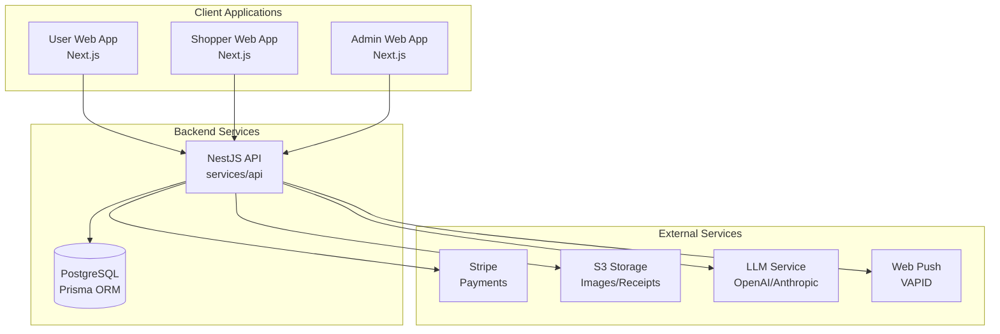

# Design Document

## Overview

Otsukai DX is a multi-tenant platform built as a monorepo with three distinct web applications (User, Shopper, Admin) sharing a common backend API. The system leverages modern web technologies including NestJS for the backend, Next.js for the frontends, and integrates with external services like Stripe for payments, S3 for file storage, and uses LLM services for natural language processing.

The architecture follows a microservices-inspired approach within a monolith, with clear separation of concerns between user-facing applications while maintaining shared business logic in the backend API.

## Architecture

### High-Level Architecture



### Technology Stack

- **Monorepo Management**: pnpm + Turborepo
- **Backend**: NestJS with TypeScript
- **Database**: PostgreSQL with Prisma ORM
- **Frontend**: Next.js 14+ with TypeScript
- **Styling**: Tailwind CSS
- **Authentication**: JWT with refresh tokens
- **Payments**: Stripe Payment Intents with manual capture
- **File Storage**: S3-compatible storage (AWS S3 or Supabase)
- **Push Notifications**: Web Push API with VAPID
- **Type Safety**: OpenAPI-generated TypeScript types

### Monorepo Structure

```
/
├── apps/
│   ├── user-web/          # User-facing application
│   ├── shopper-web/       # Shopper application  
│   └── admin-web/         # Administrative interface
├── services/
│   └── api/               # NestJS backend API
├── packages/
│   ├── ui/                # Shared UI components
│   └── types/             # Shared TypeScript types
└── tests/
    └── e2e/               # End-to-end tests
```

## Components and Interfaces

### Core Domain Models

#### User Management
- **Users**: End customers who place orders
- **Shoppers**: Service providers who fulfill orders
- **Admins**: Platform operators with different permission levels

#### Order Management
- **Orders**: Central entity containing items, preferences, and status
- **OrderItems**: Individual items within an order with price ranges and substitution rules
- **OrderRuns**: Shopper's execution of an order with status tracking

#### Communication
- **ChatMessages**: Real-time communication between users and shoppers
- **Notifications**: Push notifications for status updates

#### Financial
- **Payments**: Stripe payment tracking with authorization/capture flow
- **Receipts**: Shopper-submitted purchase verification

### API Design Patterns

#### RESTful Endpoints
- **Resource-based URLs**: `/orders`, `/shoppers`, `/users`
- **HTTP methods**: GET, POST, PATCH, DELETE
- **Consistent response formats**: JSON with standardized error handling
- **Pagination**: Cursor-based for large datasets

#### Authentication & Authorization
- **JWT Access Tokens**: Short-lived (15 minutes)
- **Refresh Tokens**: Long-lived (7 days) for token renewal
- **Role-based Access Control**: User, Shopper, Admin roles with granular permissions

#### File Upload Strategy
- **Signed URLs**: S3 pre-signed URLs for direct client uploads
- **Security**: EXIF data removal, file type validation
- **Storage**: Organized by entity type and date (e.g., `/receipts/2024/01/`)

### Frontend Architecture

#### Shared Component Library (`packages/ui`)
- **Design System**: Consistent Tailwind-based components
- **Form Components**: Reusable form inputs with validation
- **Layout Components**: Headers, navigation, modals
- **Business Components**: Order cards, chat interfaces, status indicators

#### State Management
- **Server State**: React Query for API data fetching and caching
- **Client State**: React hooks for local UI state
- **Real-time Updates**: WebSocket connections for order status and chat

#### Routing Strategy
- **User App**: Public marketing pages + authenticated order management
- **Shopper App**: Fully authenticated with onboarding flow
- **Admin App**: Role-based access with different permission levels

## Data Models

### Core Entities

```typescript
// User Management
interface User {
  id: string;
  email: string;
  phone?: string;
  subscription_tier?: 'basic' | 'premium';
  created_at: Date;
}

interface Shopper {
  id: string;
  email: string;
  phone: string;
  kyc_status: 'pending' | 'approved' | 'needs_review' | 'rejected';
  risk_tier?: 'L0' | 'L1' | 'L2' | 'L-1';
  rating_avg?: number;
  status: 'active' | 'suspended';
  created_at: Date;
}

// Order Management
interface Order {
  id: string;
  user_id: string;
  shopper_id?: string;
  status: 'new' | 'accepted' | 'shopping' | 'await_receipt_ok' | 'enroute' | 'delivered' | 'cancelled';
  mode: 'approve' | 'delegate';
  receipt_check: 'required' | 'auto';
  estimate_amount: number;
  auth_amount?: number;
  deadline_ts?: Date;
  priority?: number;
  address_json: object;
  items: OrderItem[];
  created_at: Date;
}

interface OrderItem {
  id: string;
  order_id: string;
  name: string;
  qty: string;
  price_min?: number;
  price_max?: number;
  allow_subs: boolean;
  note?: string;
}

// Communication
interface ChatMessage {
  id: string;
  order_id: string;
  sender: 'user' | 'shopper' | 'system';
  text: string;
  attachment_url?: string;
  created_at: Date;
}

// Financial
interface Payment {
  id: string;
  order_id: string;
  stripe_pi: string;
  status: 'authorized' | 'captured' | 'refunded' | 'failed';
  amount: number;
  created_at: Date;
}

interface Receipt {
  id: string;
  order_id: string;
  shopper_id: string;
  image_url: string;
  submitted_at: Date;
}
```

### Database Schema Considerations

#### Indexing Strategy
- **Primary Keys**: UUIDs for all entities
- **Foreign Keys**: Proper constraints with cascading rules
- **Search Indexes**: Full-text search on order items, user/shopper names
- **Performance Indexes**: Composite indexes on frequently queried combinations

#### Data Integrity
- **Constraints**: Check constraints for enums and business rules
- **Triggers**: Audit logging for sensitive operations
- **Soft Deletes**: Retain data for compliance and analytics

## Error Handling

### API Error Standards

#### HTTP Status Codes
- **400 Bad Request**: Invalid input data
- **401 Unauthorized**: Missing or invalid authentication
- **403 Forbidden**: Insufficient permissions
- **404 Not Found**: Resource doesn't exist
- **409 Conflict**: Business rule violation
- **422 Unprocessable Entity**: Validation errors
- **500 Internal Server Error**: Unexpected server errors

#### Error Response Format
```typescript
interface ApiError {
  error: {
    code: string;
    message: string;
    details?: object;
    timestamp: string;
    request_id: string;
  };
}
```

### Frontend Error Handling

#### Error Boundaries
- **Global Error Boundary**: Catch unexpected React errors
- **Route-level Boundaries**: Handle page-specific errors
- **Component Boundaries**: Isolate component failures

#### User-Friendly Messages
- **Network Errors**: "Connection problem, please try again"
- **Validation Errors**: Field-specific error messages
- **Business Logic Errors**: Contextual explanations with suggested actions

### Payment Error Handling

#### Stripe Integration
- **Authorization Failures**: Clear messaging about payment method issues
- **Capture Failures**: Automatic retry with exponential backoff
- **Webhook Failures**: Dead letter queue for failed webhook processing

## Testing Strategy

### Backend Testing

#### Unit Tests
- **Service Layer**: Business logic validation
- **Controller Layer**: Request/response handling
- **Repository Layer**: Data access patterns
- **Utility Functions**: Pure function testing

#### Integration Tests
- **Database Integration**: Real database operations with test data
- **External Service Mocking**: Stripe, S3, LLM service mocks
- **API Endpoint Testing**: Full request/response cycle testing

### Frontend Testing

#### Component Testing
- **Unit Tests**: Individual component behavior
- **Integration Tests**: Component interaction testing
- **Visual Regression**: Screenshot comparison testing

#### End-to-End Testing
- **User Flows**: Complete order placement and fulfillment
- **Cross-browser Testing**: Chrome, Firefox, Safari compatibility
- **Mobile Testing**: Responsive design validation

### Test Data Management

#### Fixtures and Factories
- **User Factory**: Generate test users with various configurations
- **Order Factory**: Create orders in different states
- **Payment Factory**: Mock Stripe payment objects

#### Test Environment
- **Database**: Separate test database with migrations
- **External Services**: Mock servers for Stripe, S3, LLM
- **Seed Data**: Consistent test data for E2E tests

## Security Considerations

### Authentication Security
- **JWT Security**: Short-lived tokens, secure signing algorithms
- **Password Security**: bcrypt hashing with appropriate rounds
- **Session Management**: Secure refresh token rotation

### Data Protection
- **PII Handling**: Minimal collection, secure storage, GDPR compliance
- **File Upload Security**: Virus scanning, file type validation, size limits
- **Database Security**: Encrypted connections, parameterized queries

### API Security
- **Rate Limiting**: Prevent abuse with configurable limits
- **Input Validation**: Comprehensive validation at API boundaries
- **CORS Configuration**: Restrictive CORS policies for production

### Payment Security
- **PCI Compliance**: Stripe handles card data, no PCI scope
- **Webhook Security**: Signature verification for all webhooks
- **Audit Logging**: Complete audit trail for financial operations

## Performance Considerations

### Database Performance
- **Query Optimization**: Efficient queries with proper indexing
- **Connection Pooling**: Optimized database connection management
- **Caching Strategy**: Redis for frequently accessed data

### Frontend Performance
- **Code Splitting**: Route-based and component-based splitting
- **Image Optimization**: Next.js image optimization for receipts and photos
- **Caching**: Aggressive caching for static assets and API responses

### Scalability Planning
- **Horizontal Scaling**: Stateless API design for easy scaling
- **Database Scaling**: Read replicas for reporting and analytics
- **CDN Integration**: Global content delivery for static assets

## Deployment Architecture

### Environment Strategy
- **Development**: Local development with Docker Compose
- **Staging**: Production-like environment for testing
- **Production**: High-availability deployment with monitoring

### Infrastructure Components
- **Application Servers**: Containerized Next.js and NestJS applications
- **Database**: Managed PostgreSQL with automated backups
- **File Storage**: S3 with CDN for global distribution
- **Monitoring**: Application performance monitoring and error tracking

This design provides a solid foundation for implementing the Otsukai DX platform with proper separation of concerns, scalability considerations, and robust error handling throughout the system.